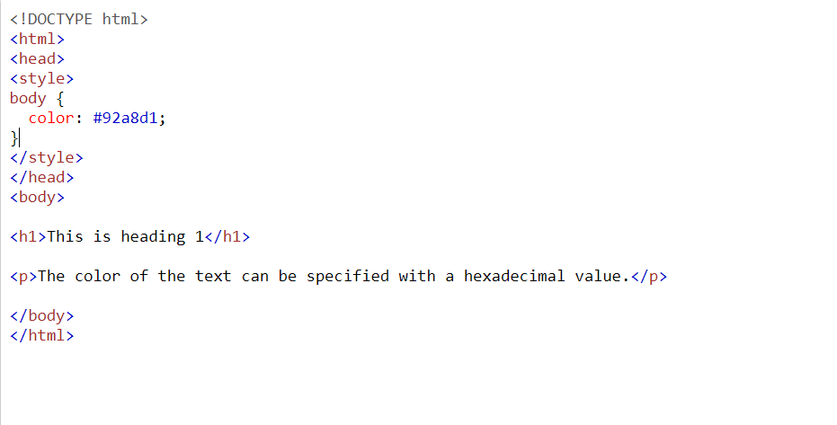
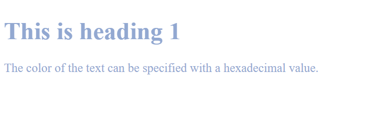

## shahd alkhatib page summarizes
# CSS color Property

## CSS (Cascading Style Sheets) allows you to create great-looking web pages, but how does it work under the hood? This article explains what CSS is, with a simple syntax example, and also covers some key terms about the language. 

## CSS is a rule-based language — you define rules specifying groups of styles that should be applied to particular elements or groups of elements on your web page. For example "I want the main heading on my page to be shown as large red text."

# The following code shows a very simple CSS rule

# Example code in css 

# The result in css

# different type of color in CSS
Code | The color result after applay the code
-----|----------------------------
color: hsl(89, 43%, 51%); | Green
color: rgba(201, 76, 76, 0.6); | pink
color: rgb(201, 76, 76); | Red 

