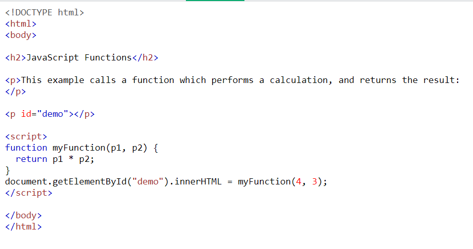
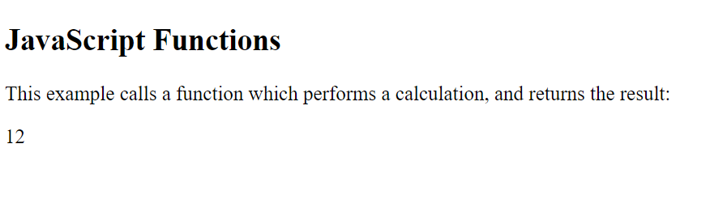

## shahd alkhatib page summarizes
# JavaScript Functions

## A JavaScript function is a block of code designed to perform a particular task.A JavaScript function is executed when "something" invokes it (calls it).

## A JavaScript function is defined with the function keyword, followed by a name, followed by parentheses ().

## Function names can contain letters, digits, underscores, and dollar signs (same rules as variables).

## The parentheses may include parameter names separated by commas:(parameter1, parameter2, ...)

## The code to be executed, byg the function, is placed inside curly brackets: {}

# The following code shows a very simple  JavaScript Functions  rule

# Example code in JavaScript Functions 

# The result in JavaScript Functions

