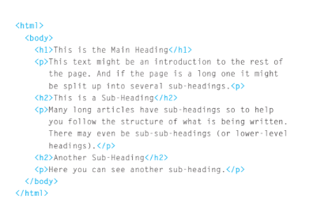
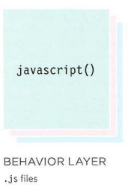

# Duckett HTML 
## Structure
* In the browser window you can see a web page that features exactly
the same content as the Word document

# Example code in  HTML code

## Extra Markup 
### Comnts in HML

1. ID Attribute 
- Every HTML element can carry
the id attribute. It is used to
uniquely identify that element
from other elements on the
page

2. Class Attribute
-  used as a 
way to identify several elements
as being different from the
other elements on the page.

3.  Block Elements
- elements always
appear to start on a new line in
the browser window. These are
known as block level elements.

4.  Inline Elements
-  elements always
appear to continue on the
same line as their neighbouring
elements.

# Duckett JS

***Each language forms a separate
layer with a different purpose.
Each layer, from left to right.
builds on the previous one***

## This is where we can change how the page behaves, adding interactivity. We will aim to keep as much of our JavaScript as possible in separate files.

