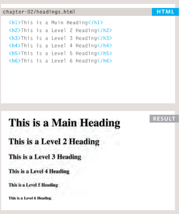
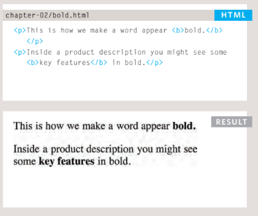
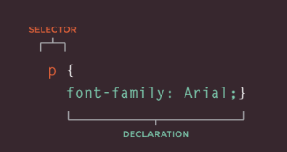
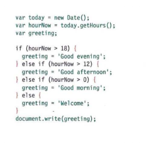
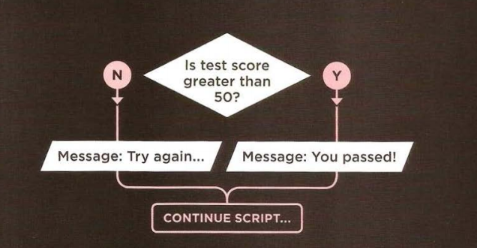
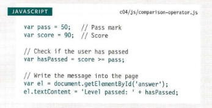

# Duckett HTML 
# Text
## Headings

# Example on Headings code with there result
## HTML has six "levels" of headings:

# Bold

## Example on Bold with code with there result
## By enclosing words in the tags <b> and </b> we can make characters appear bold.

## CSS
***CSS allows you to create rules that specify how the content of an element should appear. For example, you can specify that the background of the page is cream, all paragraphs shoul dappear in gray using the Arial typeface, or that all level one headings should be in a blue, italic, Times typeface.***
### CSS works by associating rules with HTML elements. These rules govern how the content of specifed elements should be displayed.
## A CSS rulecontains two parts:
- a selector 
-  declaration.

# Duckett JS
# JavaScript Instructions
*** A script is a series of instructions that a computer can follow one-by-one. Each individual instruction or step is known as a statement.Statements should end with a semicolon.***
### Example on if statement in JavaScript

## A statement is an individual instruction that the computer should follow. Each one should start on a new line and end with a semicolon. This makes your code easier to read and follow.
### The semicolon also tells the JavaScript interpreter when a step is over, indicating that it should move to the next step.

# Decisions and Loops
## Example on Decision Making flow chart

## Example on Javascripte

### In this example, a user is taking a test, and the script tells the user whether they have passed this round of the test.
** The example starts by setting two variables:**

-  pass to hold the pass mark
-  score to hold the users score

