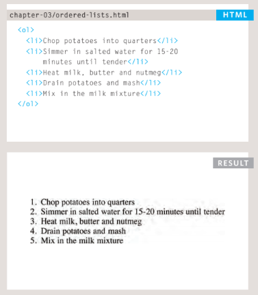
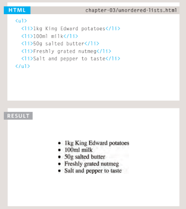
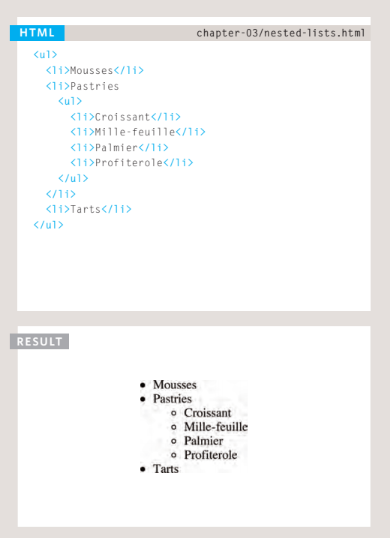
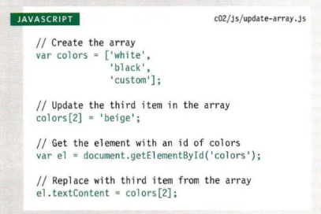
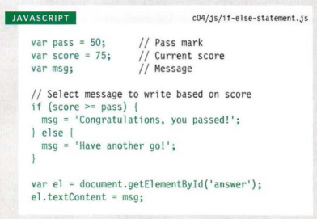
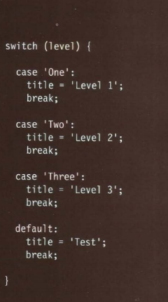

# Duckett HTML 
# Lists

# Example on Ordered Lists with result
## The ordered list is created withthe <ol> element.

# Example on Unordered Lists  with result
## The unordered list is created with the <ul> element.

# Example on Nested  Lists  with result 
## You can put a second list inside an <li> element to create a sub list or nested list.

***Type Of List***
- Nested  Lists
- Unordered Lists
- Ordered Lists

# Boxes
## border-image
***The border-image property applies an image to the border of any box. It takes a background image and slices it into nine pieces.***

## border-radius
***CSS3 introduces the ability to create rounded corners on any box, using a property called border-radius. The value indicates the size of the radius in pixels.***

------------------------------------------------------------------------------

# Duckett JS

# Basic JavaScript Instructions
***The first lines of code on the left
create an array containing a list
of three colors.
Having created the array.
To access a value from an array,
after the array name you specify
the index number for that value
inside square brackets.***
### You can change the value of an item an array by selecting it and assigning it a new value  (using the equals sign and the new value for that item).

### Example on if statement in JavaScript

## Values in an array are accessed as if they are in a numbered list. It is important to know that the numbering of this list starts at zero.

# Decisions and Loops
## Example on IF .... elese statement

***Here you can see that an if ... else statement allows you to provide two sets of code:***
* one set if the condition
evaluates to true
* another set if the condition is
false
-----------------------------------------------

## Example on SWITCH STATEMENTS

## A switch statement starts with a variable called the switch value. Each case indicates a possible value for this variable and the code that should run if the variable matches that value.

-------------------------------------------------------
# Difference between IF .. ELSE and the  SWITCH
IF .. ELSE  | SWITCH
------------ | -------------
There is no need to provide an else option. (You can just use an if statement.)|You have a default option that is run if none of the cases match.
With a series of if statements, they are all checked even if a match has been found (so it performs more slowly than switch)| If a match is found, that code is run; then the break statement stops the rest of the switch statement running (providing better performance than multiple if statements).

