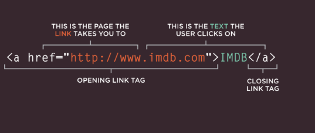
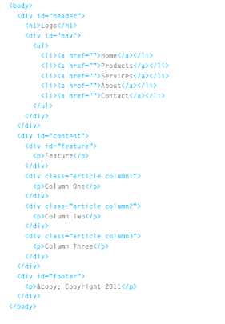
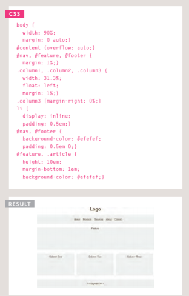
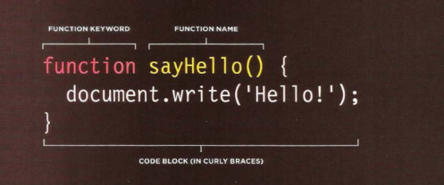
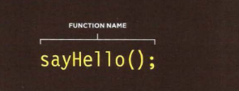
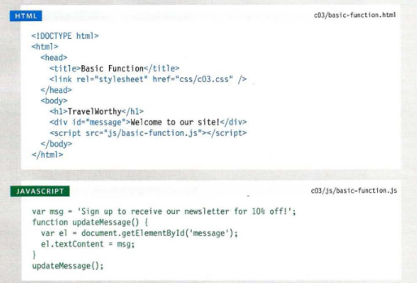

# Duckett HTML 
# Links

## Links are created using the a element. Users can click on anything between the opening a tag and the closing /a tag. You specify which page you want to link to using the href attribute.
***Example on the structure of link***

## Below you can see the link to IMDB that was created.When click on the IMDB it will go to the website for IMDB.

# Layout
## The liquid layout
## The liquid layout usespercentages to specify the width of each box so that the design will stretch to ft the size of thescreen.

## Example on liquid layout code in HTML

-------------------------------------------------------

## The css style with the result on the liquid layout code in HTML

--------------------------------------------------------------------

***There is a rule on the <body> element to set the width of the page to 90% so that there is a small gap between the left and right-hand sides of the browser window and the main content. The three columns are all given a margin of 1% and a width of 31.3%. This adds up to 99.9% of the width of the <body> element, so some browsers might not perfectly align the right-hand side of the third column with other elements on the page.***

----------------------------------------------------------------------

# Duckett JS

# Functions, Methods, and Objects

# WHAT IS A FUNCTION?
## Functions let you group a series of statements together to perform a specific task. If different parts of a script repeat the same task,  can reuse the function.

 ## Example on how to  declare a function  in JavaScript

 ## Example on how to Call  a function  in JavaScript

 ## Example on FUNCTION in JavaScript with result

***In this example, the user is
shown a message at the top of
the page. The message is held
in an HTML element whose id
attribute has a value of message.
The message is going to be
changed using JavaScript.***

