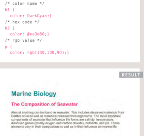
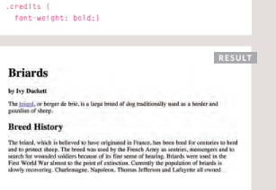

# Duckett HTML 
# Images

## To add an image into the page you need to use an  element. This is an empty element (which means there is no closing tag).

## image element contain 
1. src :  This tells the browser where
it can fnd the image fle
2. alt : This provides a text description
of the image which describes the
image if you cannot see it.
3. title : provide additional information
about the image. 

## Below you can see the code for insert image in HTML with result.

# Color
***The color property allows you
to specify the color of text inside
an element.***
### You can specify any color in CSS in one of three ways :
1.rgb values : These express colors in terms
of how much red, green and
blue are used to make it up.
-  For example: rgb(100,100,90)

2. hex codes :  These are six-digit codes that
represent the amount of red,
green and blue in a color,
preceded by a pound or hash #
sign. 
- For example: #ee3e80
3. color names
There are 147 predefned color
names that are recognized
by browsers.
-  For example: DarkCyan

## Below you can see the code for dealing with color in HTML with result.

# Text

## There are properties to control the choice For Text sush as : 
1. font
2. size
3. weight
4. style
5.  spacing.
--------------------------------
*** There is a limited choice of fonts***
***You can control the space between lines of text individual letters, and words.***

## Text can  aligned
-  left
- right
- center
- justifed
- indented

## The font-weight property allows you to create bold text.

## There are two values that this ,property commonly takes :
1. normal
-  text to appear at a
normal weight.
2. bold
-  text to appear bold.

## In this example, you can see that the element whose clas attribute has a value of credits has been bolded.

