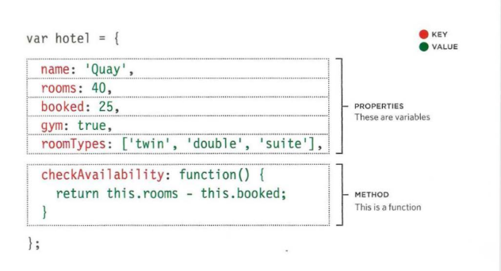
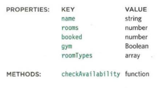
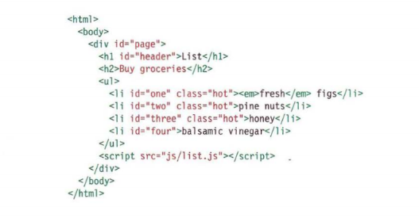
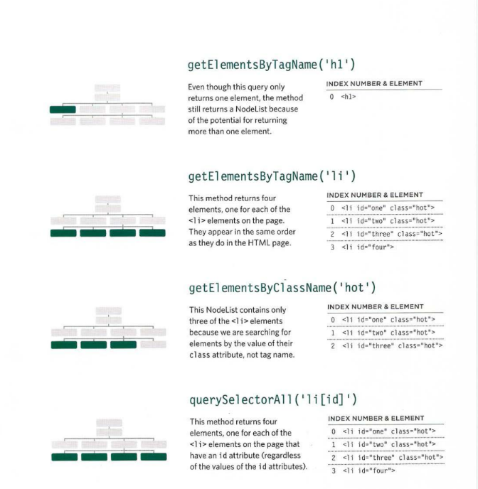

# Duckett JS book 
# Object Literals

## This object represents a hotel. It has five properties and one method. The object is in curly braces. It is stored in a variable called hotel.
### Like variables and named functions, properties and methods have a name and a value. In an object, that name is called a key.

### An object cannot have two keys with the same name. This is because keys are used to access their corresponding values.

## Below you can see the  Key  in red colors and the value in green color for properties and method for object hotel .

## The value of a property can be a string, number, Boolean, array, oreven another object. The value of a method is always a function.

## Below you can see the Key and the value for properties and method.

# Document Object Model
***THE DOM TREE IS AMODEL OF A WEB PAGE***

***As a browser loads a web page, it creates a model of that page.
The model is called a DOM tree, and it is stored in the browsers' memory.
It consists of four main types of nodes.***

## Below you can see BODY OF HTML PAGE

## Main types of nodes.

1. THE DOCUMENT NODE

***Above, you can see the HTML code for a shopping
list, and on the right hand page is its DOM tree.
Every element, attribute, and piece of text in the
HTML is represented by its own DOM node.***

2. ELEMENT NODES

***HTML elements describe the structure of an HTML page. (The <h l> - <h6> elements describe what parts are headings; the 
 tags indicate where paragraphs of text start and finish; and so on.) To access the DOM tree, you start by looking for elements. Once you find the element you want, then you can access its text and attribute nodes if you want to***
---------------------------------
## A Nodelist is a collection of element nodes. 
- Each node is given an index number (a number that starts
at zero, just like an array).
- The order in which the element nodes are stored in a
Node List is the same order that they appeared in the
HTML page.

###  A different DOM queries that all return a Nodelist.

