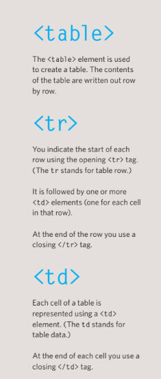
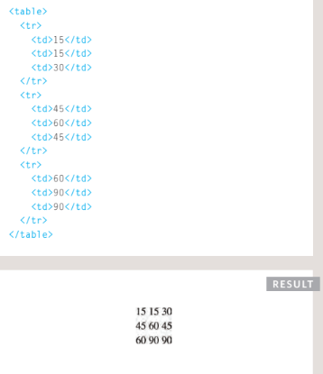
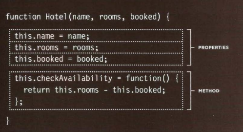
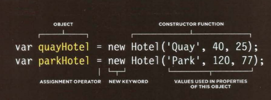

# Duckett HTML 
# Tables

## Tables : The <table> element is used to create a table. The contents of the table are written out row by row.

## Basic Table Sructure

## Below you can see the code for create a  table in HTML with result.

# Duckett JS Book:

# Functions, Methods, and Objects

## Sometimes to want several objects to represent similar things.

## Object constructors can use a function as a template for creating objects.First, create the template with the object's properties and methods.
### A function called Hotel will be used as a template for creating new objects that represent hotels. Like all functions, it contains statements. In this case, they add properties or methods to the object.

### The function  Below has three parameters. Each one setsthe value of a property in the object. The methods will be the same for each object created using this function.

# Below you can see the code for dealing with object creating and have a 3 parameters and have a 1 function inside.

# Below you can see the code for dealing with  creating instance of the object  and have a constractor function have 3 value of parameters.

