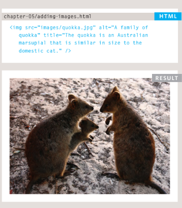

# Duckett HTML 
# Tables

## To add an image into the page you need to use an  element. This is an empty element (which means there is no closing tag).

## image element contain 
1. src :  This tells the browser where
it can fnd the image fle
2. alt : This provides a text description
of the image which describes the
image if you cannot see it.
3. title : provide additional information
about the image. 

## Below you can see the code for insert image in HTML with result.

# Duckett JS Book:

## Functions, Methods, and Objects
***Sometimes to want several objects to represent similar things.
Object constructors can use a function as a template for creating objects.First, create the template with the object's properties and methods.***
### A function called Hotel will be used as a template for creating new objects that represent hotels. Like all functions, it contains statements. In this case, they add properties or methods to the object.

### The function  Below has three parameters. Each one setsthe value of a property in the object. The methods will be the same for each object created using this function.

## Below you can see the code for dealing with object creating and have a 3 parameters and have a 1 function inside.

## Below you can see the code for dealing with  creating instance of the object  and have a constractor function have 3 value of parameters.

