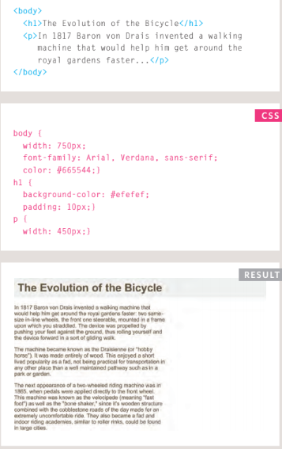
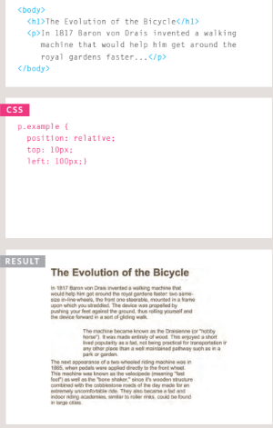
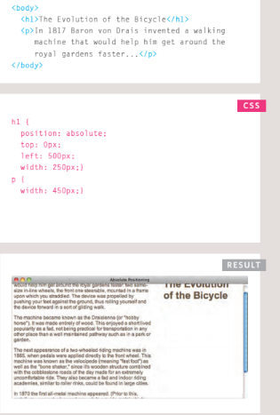
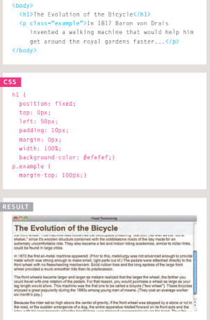

# Duckett HTML 
# Layout

# Normal Flow position:static
***In normal flow, each block-level
element sits on top of the next
one. Since this is the default
way in which browsers treat
HTML elements, you do not
need a CSS property to indicate
that elements should appear
in normal flow.***

## Below you can see the code of the HTML and css styles with result.

# Relative Positioning position:relative
***element in relation to where it
would have been in normal fow.
For example, you can move it 10
pixels lower than it would have
been in normal fow or 20% to
the right.
You can indicate that an element
should be relatively positioned
using the position property
with a value of relative.***

## Below you can see the code of the HTML and css styles with result.

# Absolute Positioning position:absolute

***When the position property
is given a value of absolute,
the box is taken out of normal
fow and no longer affects the
position of other elements on
the page. 
The box offset properties (top
or bottom and left or right)
specify where the element
should appear in relation to its
containing element.***

## Below you can see the code of the HTML and css styles with result.

# Fixed Positioning position:fixed

***Fixed positioning is a type
of absolute positioning that
requires the position property
to have a value of fixed.

It positions the element in
relation to the browser window.
Therefore, when a user scrolls
down the page, it stays in the
exact same place. It is a good
idea to try this example in your
browser to see the effect.***

## Below you can see the code of the HTML and css styles with result.

