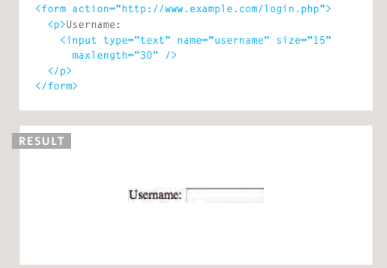
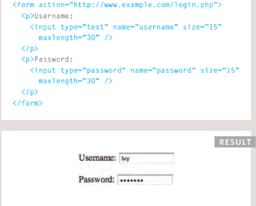
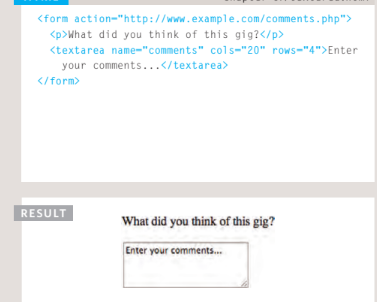
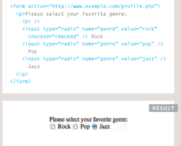
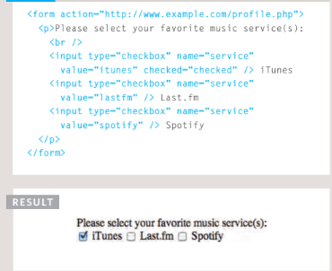
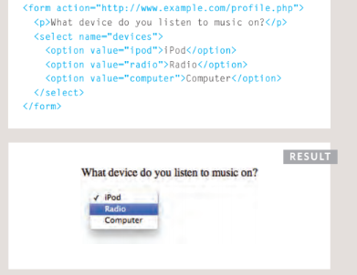
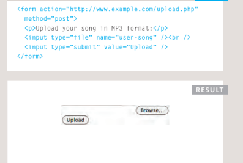
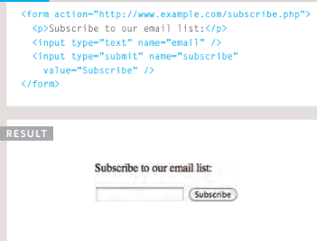

# Duckett HTML 
# Forms

# Form Structure

## Form controls live inside a <form> element. This element should always carry the action attribute and will usually have a method and id attribute too.

### action : Every <form> element requires an action attribute. Its value is the URL for the page on the server that will receive the information in the form when it is submitted.

### method :Forms can be sent using one of two methods: get or post.

# input
### The input element is used to create several different form controls. The value of the type attribute determines what kind of input they will be creating.
### type="text" When the type attribute has a value of text, it creates a single line text input.

### name : When users enter information into a form, the server needs to know which form control each piece of data was entered into. (For example, in a login form, the server needs to know what has been entered as the username and what has been given as the password.) Therefore, each form control requires a name attribute. The value of this attribute identifes the form control and is sent along with the information they enter to the server.

# Example on input type text with result window

# password type

***When the type attribute has
a value of password it creates
a text box that acts just like a
single-line text input, except
the characters are blocked out.
They are hidden in this way so
that if someone is looking over
the user's shoulder, they cannot
see sensitive data such as
passwords.***

# Example on input type text with result window

# textarea  
***The <textarea> element
is used to create a mutli-line
text input. Unlike other input
elements this is not an empty
element. It should therefore have
an opening and a closing tag.***

# Example on  textarea with result window

# radio  type

***Radio buttons allow users to pick
just one of a number of options.
name The name attribute is sent to
the server with the value of the
option the user selects. When
a question provides users with
options for answers in the form
of radio buttons, the value of
the name attribute should be the
same for all of the radio buttons
used to answer that question.***

# Example on input type radio with result window

# checkbox type
***Checkboxes allow users to select
(and unselect) one or more
options in answer to a question.
name
The name attribute is sent to
the server with the value of the
option(s) the user selects. When
a question provides users with
options for answers in the form
of checkboxes, the value of the
name attribute should be the
same for all of the buttons that
answer that question.***

# Example on input type checkbox with result window

# drop down list box 
***A drop down list box (also
known as a select box) allows
users to select one option from a
drop down list.
The select element is used
to create a drop down list box. It
contains two or more option
elements.
The name attribute indicates the
name of the form control being
sent to the server.***

# Example on input type drop down list with result window

# file type

***This type of input creates a
box that looks like a text input
followed by a browse button.
When the user clicks on the
browse button, a window opens
up that allows them to select a
fle from their computer to be
uploaded to the website.***

# Example on input type file with result window

# input type="submit"
# The submit button is used to send a form to the server.

# Example on input type submit with result window

------------------------------------------------------------------------------
