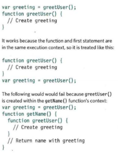
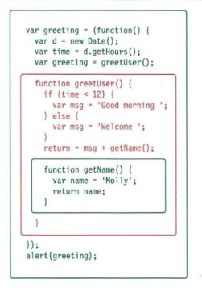

# EXECUTION CONTEXT & HOISTING

## Each time a script enters a new execution context, there are two phases of activity:
1. PREPARE
- The new scope is created
- Variables, functions, and arguments are created
- The value of the this keyword is determined

# Example code in creating  javascript function with variables

***Understanding that these two phases happen helps
with understanding a concept called hoisting. You
may have seen that you can:***
-  Call functions before they have been declared
(if they were created using function declarations
not function expressions)
-  Assign a value to a variable that has not yet been
declared

***This is because any variables and functions within
each execution context are created before they are
executed.
The preparation phase is often described as taking
all of the variables and functions and hoisting them
to the top of the execution context. Or you can think
of them as having been prepared.
Each execution context also creates its own
variables object. This object contains details of all
of the variables, functions, and parameters for that
execution context.***

2. EXECUTE
- Now it can assign values to variables
-  Reference functions and run their code
-  Execute statements

 
------------------------------------------------
# UNDERSTANDING SCOPE
## In the interpreter, each execution context has its own variables object. It holds the variables, functions, and parameters available within it. Each execution context can also access its parent's variables object.

***If a variable is not found in the variables object
for the current execution context, it can look in the
variables object of the parent execution context.
But it is worth knowing that looking further up the
stack can affect performance, so ideally you create
variables inside the functions that use them.***

- Each time a function is called, it gets its own
execution context and variables object.
- Each time an outer function calls an inner function,
the inner function can have a new variables object.
- But variables in the outer function remain the same.
- Note: you cannot access this variables object from
your code; it is something the interpreter is creating
and using behind the scenes. But understanding
what goes on helps you understand scope.

## Example code in  javascript function scope  

