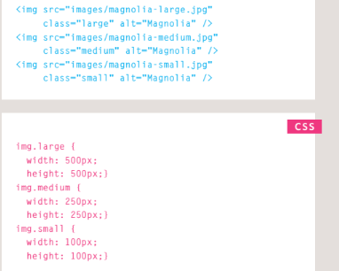
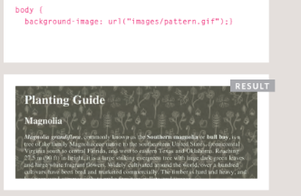

# Controlling sizes of images in CSS

## You can control the size of an image using the width and height properties in CSS.

 ***Specifying image sizes helps pages to load more smoothly
because the HTML and CSS
code will often load before the
images, and telling the browser
how much space to leave for an
image allows it to render the rest
of the page without waiting for
the image to download.***

# Example code in control of the image sizes  in CSS with result 

----------------------------------------------

1. First you need to determine the
sizes of images that will be used
commonly throughout the site,
2. then give each size a name.
- For example:
1. small
2. medium
3. large
- Where the img elements
appear in the HTML, rather
than using width and height
attributes you can use these
names as values for the class
attribute.
- In the CSS, you add selectors for
each of the class names, then
use the CSS width and height
properties to control the image
dimensions.

# Background Images

## The background-image property allows you to place an image behind any HTML element. This could be the entire page or just part of the page. By default, a background image will repeat to fll the entire box.
- The path to the image follows
the letters url, and it is put
inside parentheses and quotes.

# Example code in set a background image for body with result 

