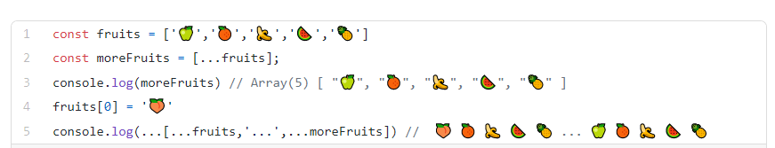
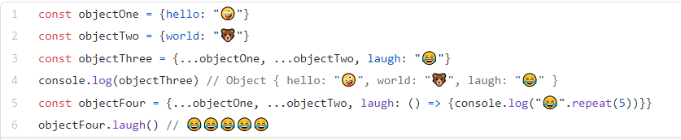

## What does .map() return?
### map() function to take an array of numbers  , transforming arrays into lists of elements is nearly identical.

## If I want to loop through an array and display each value in JSX, how do I do that in React?

1. You can build collections of elements and include them in JSX using curly braces {}.

2.  loop through the numbers array using the JavaScript map() function.
3.   return a li element for each item.
4.  Finally,  assign the resulting array of elements to listItems

## Each list item needs a unique by   use IDs from your data as keys:

## What is the purpose of a key?
## Keys only make sense in the context of the surrounding array.

# The Spread Operator

## What is the spread operator?

### The spread operator was added to JavaScript in ES6 (ES2015), just like the rest parameters, which have the same syntax: three magic dots ….

## List 4 things that the spread operator can do.

* Copying an array
* Concatenating or combining arrays
* Using Math functions
* Using an array as arguments
* Adding an item to a list

# Give an example of using the spread operator to add a new item to an array.

## Below you can see the using the spread operator to add a new item to an array.

# Give an example of using the spread operator to combine two objects into one.
## Below you can see the code ofspread operator to combine two objects into one.

