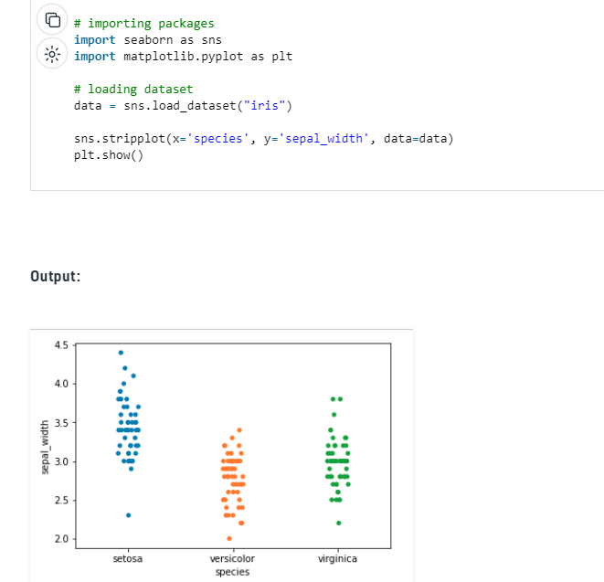

#  Matplotlib Pyplot
## Pyplot : Most of the Matplotlib utilities lies under the pyplot , and  the plt alias:
## ----------------------------------------------------
## import matplotlib.pyplot as plt
### Example : Draw a line in a diagram from position (0,0) to position (6,250): 
### import matplotlib.pyplot as plt
### import numpy as np
### xpoints = np.array([0, 6])
### ypoints = np.array([0, 250])
### plt.plot(xpoints, ypoints)
### plt.show()
## Result:  
## 
## -------------------------------------------------------
# Seaborn 
## Seaborn is a Python data visualization library based on matplotlib. has the following dependencies: 

### 1-  Python 2.7 or 3.4+
### 2- numpy
### 3- scipy
### 4- pandas
### 5- matplotlib

##  Example : plotting a simple line plot using the iris dataset.
## 
## -------------------------------------------------------

# Stripplot : A strip plot is a scatter plot where one of the variables is categorical
## Syntax: stripplot([x, y, hue, data, order, …])

### It basically creates a scatter plot based on the category.
### It is created using the stripplot() method.
###  Example : plotting a simple line plot using the iris dataset.
# 

## -------------------------------------------------------