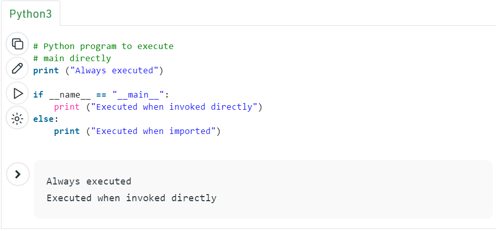
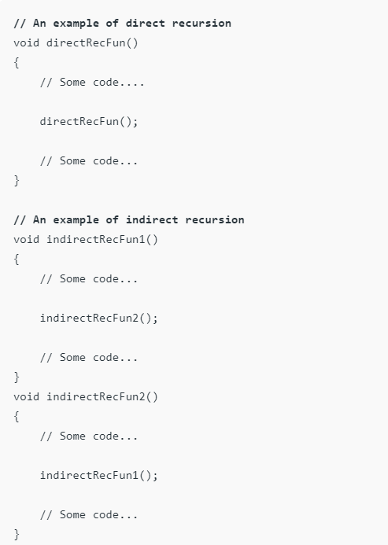

# In Tests We Trust — TDD with Python

## Unit tests are some pieces of code to exercise the input, the output and the behaviour of your code.

# If name equals main

## What does the if __name__ == “__main__”: do?

## execute file as command to the python interpreter,  python script.py example in the image below : 

# Advantages of using of the If name equals main is  : 

1. Every Python module has it’s __name__ defined and if this is ‘__main__’, it implies that the module is being run standalone by the user and we can do corresponding appropriate actions.

2. If  import this script as a module in another script, the __name__ is set to the name of the script/module.

# Recursion
##  What is Recursion? 

### The means by which a function calls itself immediately or indirectly is called recursion and the similar function is called a recursive function.
### Using a recursive algorithm, particular difficulties can be resolved considerably simply.

## How a appropriate difficulty is determined using recursion? 
### The purpose is to explain a difficulty in terms of one or smaller difficulties and attach one or more base situations that stop the recursion. 

## What is the difference between direct and indirect recursion? 

### A function fun is named direct recursive if it calls the corresponding function fun.
### A function fun is estimated indirect recursive if it calls a different function say fun_new and fun_new calls fun directly or indirectly.
### Inconsistency among direct and indirect recursion has been illustrated in the below image :

