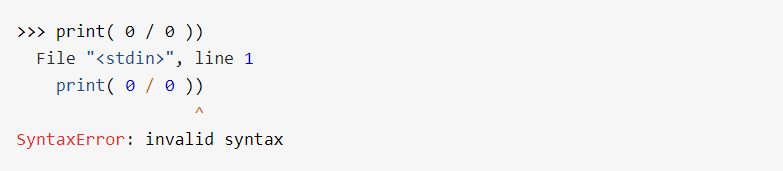
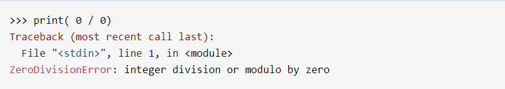
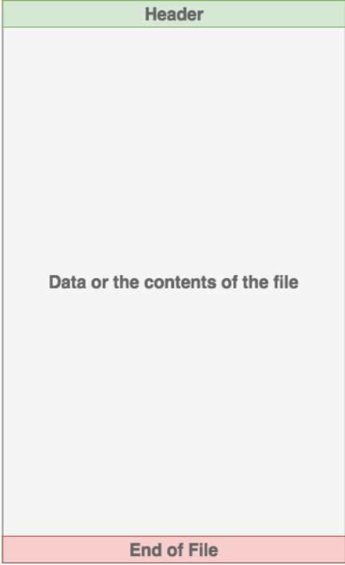

# Reading and Writing Files in Python (Guide)

## 1. Syntax errors occur when the parser detects an incorrect statement. In the image below you can see there is a syntax error happen :

## The arrow indicates where the parser ran into the syntax error. 

### In the below image you can see ZeroDivisonError  erroe happen result is divide by zero :

### This time, you ran into an exception error. This type of error occurs whenever syntactically correct Python code results in an error. The last line of the message indicated what type of exception error you ran into.

## The AssertionError Exception

### 1.  If this condition turns out to be True, then that is work correctly ! The program can continue. 
### 2. If the condition turns out to be False, you can have the program throw an AssertionError exception.

# Python Exceptions: An Introduction
## What Is a File?
## Files on most modern file systems are composed of three main parts:

### 1. Header: 
metadata about the contents of the file (file name, size, type, and so on)
### 2. Data: 
contents of the file as written by the creator or editor
### 3. End of file (EOF):
 special character that indicates the end of the file
### in the following image you can see the 3 composed of three main parts: Header, Data and EOF.

## File Paths
### When you access a file on an operating system, a file path is required.
### The file path is a string that represents the location of a file.
## It’s broken up into three major parts:

### 1. Folder Path: the file folder location on the file system where subsequent folders are separated by a forward slash / (Unix) or backslash \ (Windows).
### 2. File Name: the actual name of the file.
### 3. Extension: the end of the file path pre-pended with a period (.) used to indicate the file type.
