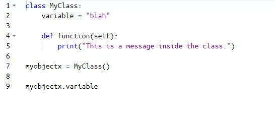
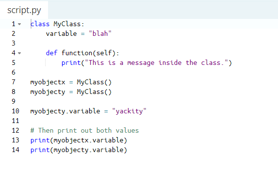
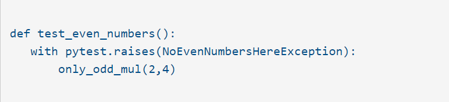
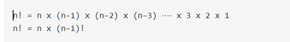

# Classes and Objects
- [x]  Objects are an encapsulation of variables and functions into a single entity. 
- [x] Objects get their variables and functions from classes. 
- [x] Classes are essentially a template to create your objects. 

## Accessing Object Variables
### To access the variable inside of the newly created object "myobjectx" in the following example :

### To create multiple different objects that are of the same class(have the same variables and functions defined).
### Each object contains independent copies of the variables defined in the class.

## For accessing Object Functions :

### To access a function inside of an object you use notation similar to accessing a variable in the below example:

# Python Testing with pytest: Fixtures and Coverage

##  how can you include code coverage with pytest? 
- [x] It turns out that there's a package called pytest-cov on PyPI that by download.
- [x] when done, can invoke pytest with the --cov option.

### pytest --cov=mymul .

### To coverage report into something human-readable by coverage html
### creates a directory called htmlcov. in  index.html file in this directory using the browser : 

# Thinking Recursively in Python

## Recursive Functions in Python
### The function  continue to call itself and repeat its behavior until some condition if  met the return a result.
### All recursive functions share a common structure made up of two parts:
### 1. base case 
### 2. recursive case.
### In the below image you can see the recursive function how work 
