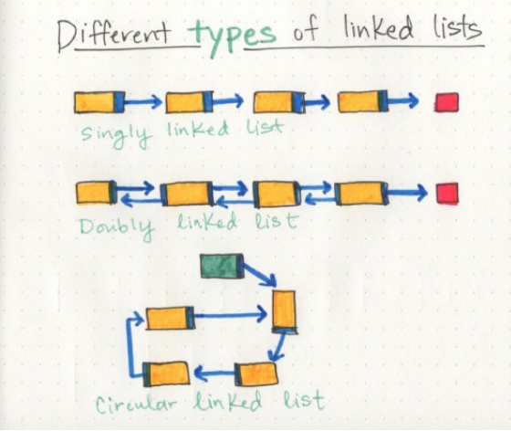
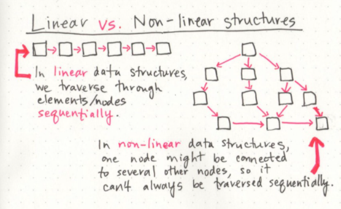
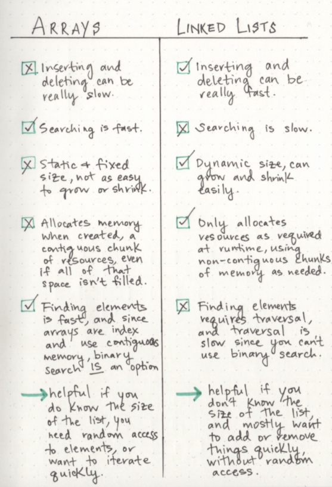
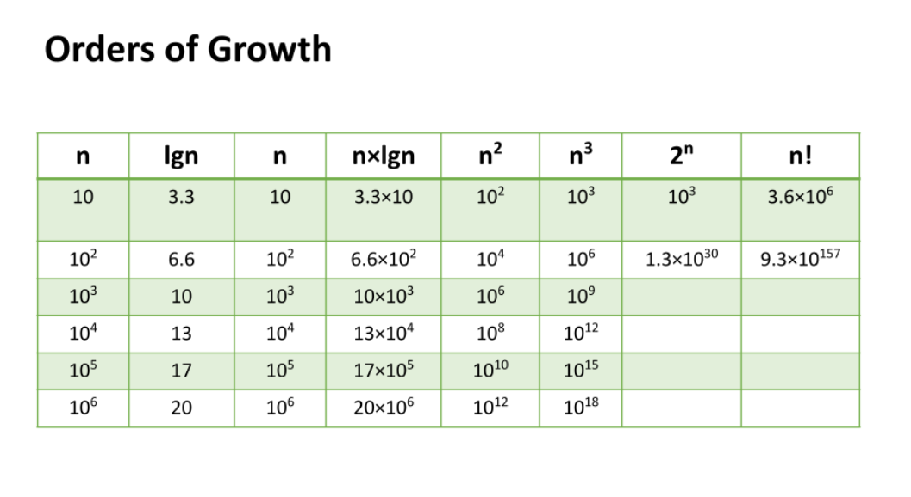

# Linked List
## -  Linked list is a linear collection of data elements whose order is not given by their physical placement in memory.

## -  Efficient when it comes to adding and removing most elements.
## - but can be slow to search and find a single element.

### In the image 1. below you can see the differnt type of linked list in the single , doubly and circular linked list .

# Linear data structures

## Linear data structures is s a sequence and an order to how they are constructed and traversed.

### When we organize our data into hashes , by implement a non-linear data structure such as : 
### 1. Trees 
### 2. graphs 

### In the image below that clerify a diferent between the Linear and Non linear structures :

## The differnt between the Arrays and the Linked List
### In the image below that clerify the diferent between the array and linked list :

# Big O: Analysis of Algorithm Efficiency

## 4 Key Areas for analysis:
### Input Size
- Input Size refers to the size of the parameter values that are read by the algorithm.
### Units of Measurement

The Three Measurements of time:

1.  The time in milliseconds from the start of a function execution until it ends.

2. The number of operations that are executed.

3. The number of “Basic Operations” that are executed.

### Orders of Growth
what order of Growth effect :
- Describe the  overall efficiency by using the input size n .
-  Measuring the overall Units of Space and Time required for the given input size n. 
- The below table plots an Order of Growth for space and time to a given value n, with the very first column representing the size of n.

### What are the differnt between the Best Case, Worst Case, and Average Case: 
- Worst Case: The efficiency for the worst possible input of size n
- Best Case: The efficiency for the best possible input of size n
- Average Case: The efficiency for a “typical” or “random” input of size n

