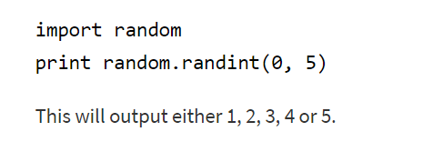
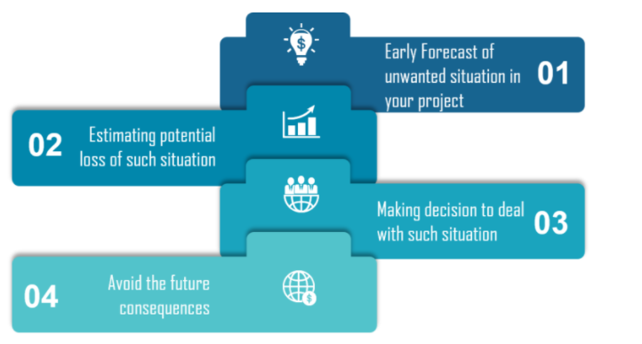
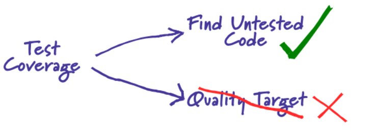

# How to use the Random Module in Python
## When to use it?
###  1 . We want the computer to pick a random number in a given range Pick a random element from a list, pick a random card from a deck, flip a coin.
### 2.  When making your password database more secure or powering a random page feature of your website.

### Random functions : contains some very useful functions.
### Randint : If we wanted a random integer, we can use the randint function Randint accepts two parameters: a lowest and a highest number.
### --->  Generate integers between 1,5. 
### --->  The first value should be less than the second.

# What is Risk Analysis in Software Testing and how to perform it?
## --> The process of identifying the risks in application that built and prioritizing them to test.
## Risk Identification
- ## There are different sets of risks, Those are as follows:

### 1. Business Risks:
-  This risk is the most common risk associated with our topic. It is the risk that may come from your company , not from your project.

### 2. Testing Risks:
-  You should be well acquainted with the platform you are working on, along with the software testing tools being used.

### 3. Premature Release Risk:
-  a fair amount of knowledge to analyze the risk associated with releasing unsatisfactory.

### 4. Software Risks:
-  risks associated with the software development process.
## Risk Assessment
 ### After risk identification, assessment has to be dealt programmatically. There are a few perspectives on risk assessment.
  

# TestCoverage
##  called code coverage : useful tool for finding untested parts of a codebase.

### -  why people focus on coverage numbers??
###  because they want to know if they are testing enough.
### -  Certainly low coverage numbers ----> say below half, are a sign of trouble. 
### - But high numbers  ---->  don't necessarily mean much, and lead to ignorance-promoting dashboards.